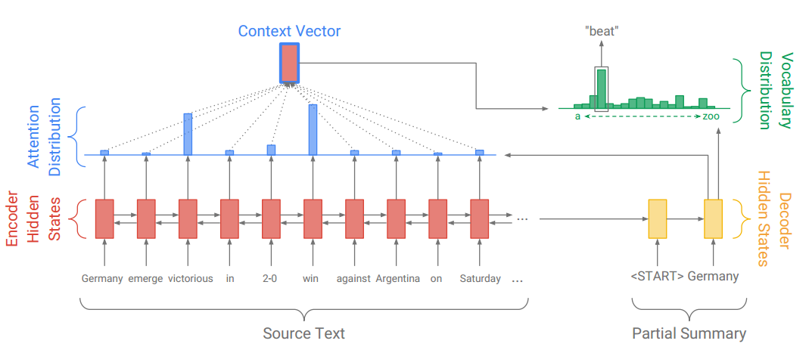
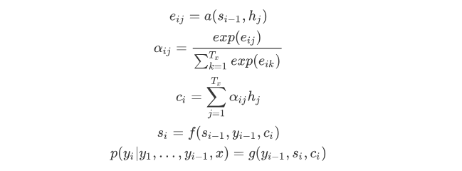
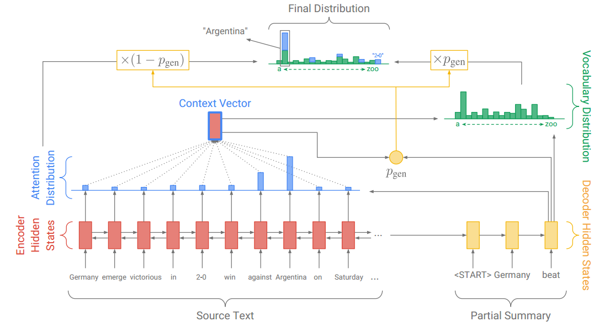
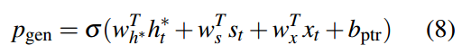
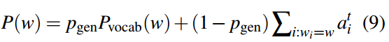

# SEQ2SEQ

- ### Paper

  [Neural Machine Translation By Jointly Learning to Align and Translate](https://arxiv.org/abs/1409.0473)

  [Modeling Coverage for Neural Machine Translation](https://arxiv.org/abs/1601.04811)    [code](https://github.com/tuzhaopeng/NMT-Coverage)

  [Get To The Point: Summarization with Pointer-Generator Networks](https://arxiv.org/abs/1704.04368)    [code](https://github.com/abisee/pointer-generator)

  [Cluster-based Beam Search for Pointer-Generator Chatbot Grounded by knowledge](http://workshop.colips.org/dstc7/papers/03.pdf)

  

- ### Data

  ```
  dialog.train	train data
  dialog_s.train	only one dialog, for test whether model can covergence
  dialog.test		test data
  
  # pointer-generator
  dialog_pg.train
  dialog_pg.test
  vocab_pg	which have no '镇'
  ```

  

- ### Model

  - base-v0   base api of tensorflow

  
  - base-v1   api of tf-seq2seq
  
    
    
    
    
  - Converage
  
    
  
  - Pointer-Generator
  
    
  
  ​       
  
  ​		

