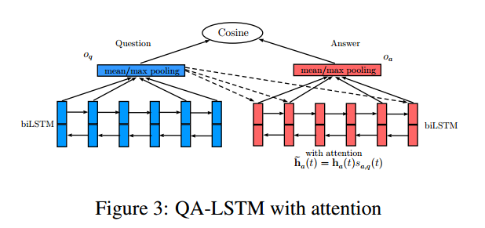
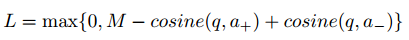

### QA-LSTM





#### RUN

```
data_helper.py	# generate the train and test data
main.py  		# train the model
lstm_ranking.py	# get the textual feature for ranking
bm25.py   		# select sim query from unsupervised data
```


#### data-format

```
# train.json / test.json
{'query':'*******', 'candidates':['*****', '******']}
{'query':'*******', 'candidates':['*****', '******']}
...

default: different line, query has different meanings or intents
```


#### PAPER

[LSTM-based Deep Learning Models for Non-factoid Answer Selection](https://arxiv.org/abs/1511.04108)